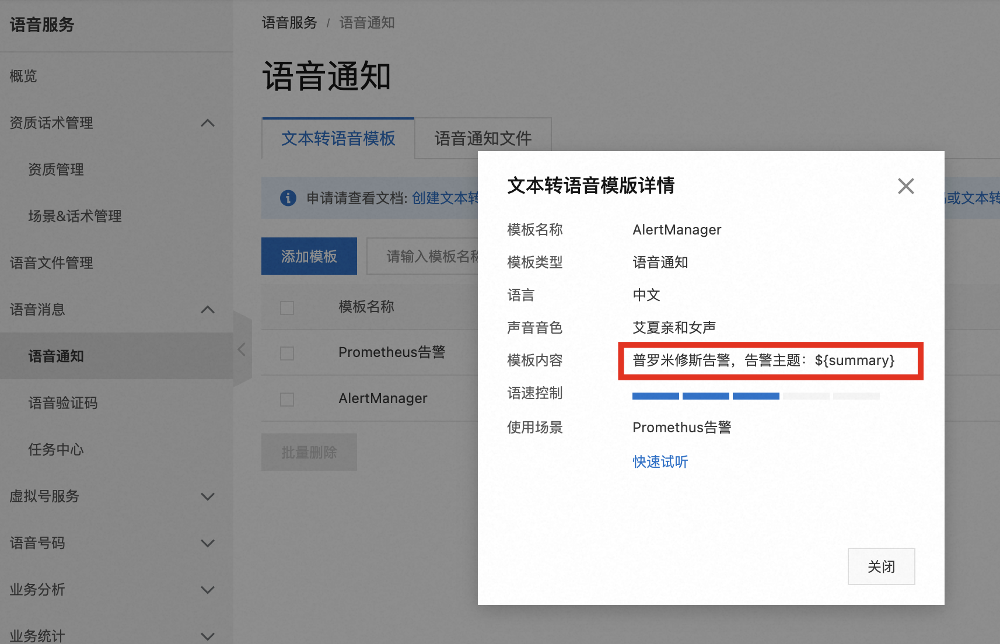

# alertmanager-aliyun-phone
alertmanager语音告警
## 阿里云配置
阿里云开通语音服务，使用${summary}变量。


## 启动命令
配置`config.yaml`后，启动服务
```bash
./alertmanager-aliyun-phone
```
默认监听8890端口

## Alertmanager配置
```yaml
apiVersion: v1
kind: ConfigMap
metadata:
  name: alertmanager-conf
  namespace: thanos
data:
  config.yaml: |-
    global:
      ...
    route:
      ...
      routes:
        - match_re:
            sd_instance_name: '.*v100.*'
          continue: true
          receiver: 'gpu'
        - match_re:
            severity: "critical"
          continue: true
          receiver: 'ops'
    receivers:
      - name: "ops"
        webhook_configs:
        - send_resolved: true
          - url: http://alertmanager-webhook-feishu:9000/hook/ops # 飞书告警
          - url: http://172.22.225.201:8890/ops # 电话告警
      - name: "gpu"
        webhook_configs:
        - send_resolved: true
          - url: http://alertmanager-webhook-feishu:9000/hook/recommend
          - url: http://172.22.225.201:8890/gpu
```

服务会根据`/ops`和`/gpu`之类的uri去配置文件中匹配电话号码。